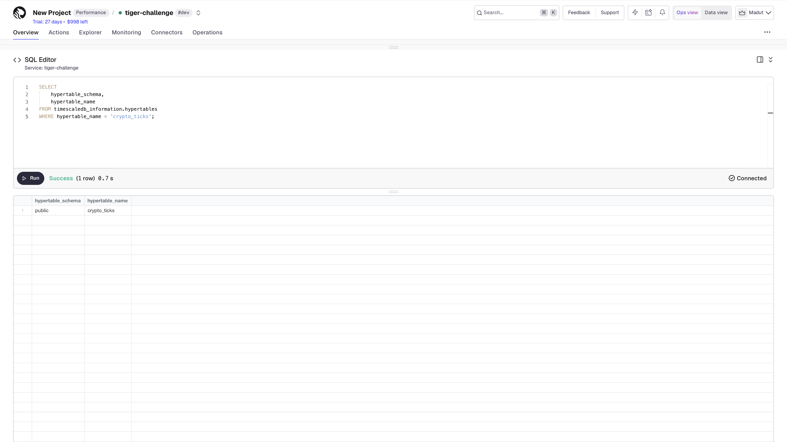
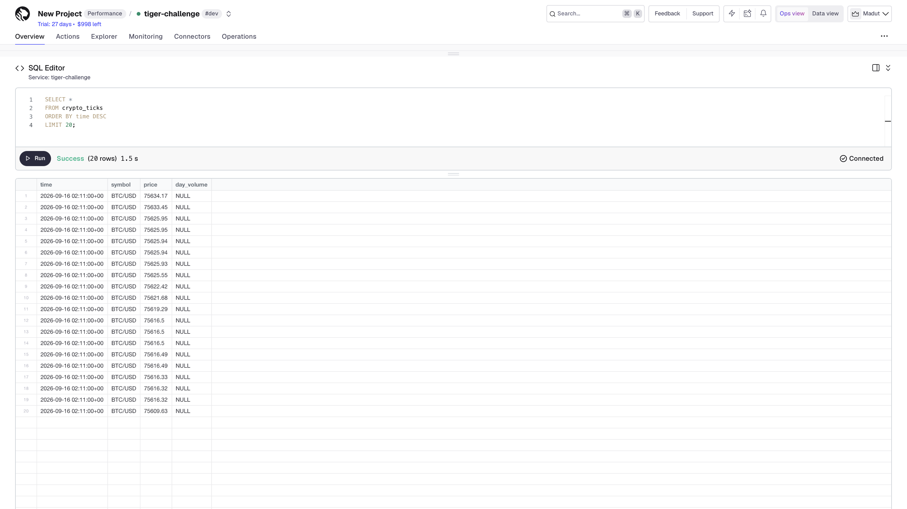
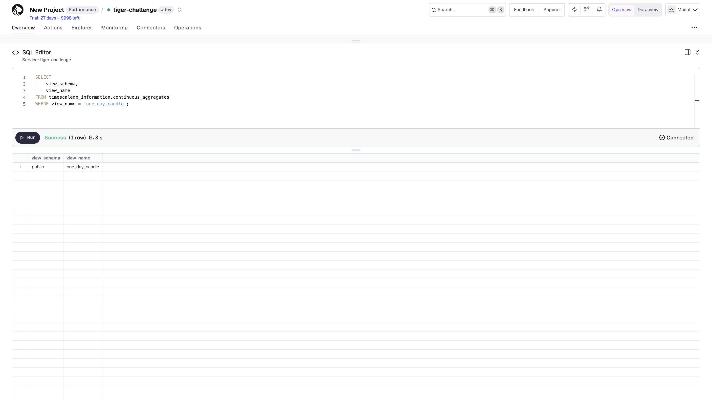

# 📈 Real-Time Financial Data Pipeline with Tiger Cloud

A real-time financial data ingestion pipeline using **Twelve Data, Python, PostgreSQL, and TimescaleDB on Tiger Cloud**.

## Overview

This project demonstrates the ingestion of real-time financial market data through a WebSocket API and its storage in a **TimescaleDB hypertable hosted on Tiger Cloud**.

The pipeline receives cryptocurrency price events, batches the incoming data, and stores the results for time-series analysis and aggregation.

## Architecture

```text
Twelve Data WebSocket
        ↓
Python Ingestion Pipeline
        ↓
Batch Processing
        ↓
Tiger Cloud / TimescaleDB
        ↓
crypto_ticks Hypertable
        ↓
Daily OHLCV Continuous Aggregate
```

## Features

* Real-time financial data ingestion
* Twelve Data WebSocket integration
* TimescaleDB hypertable storage
* Batched database inserts
* Daily OHLCV aggregation
* SQL-based time-series analysis
* Continuous Aggregate for efficient time-series queries
* Secure environment-based configuration

## Technologies

* **Python**
* **Twelve Data**
* **PostgreSQL**
* **TimescaleDB**
* **Tiger Cloud**
* **Psycopg2**

## Data Sources

The pipeline currently subscribes to:

* `BTC/USD`
* `ETH/USD`

## Project Structure

```text
.
├── README.md
├── requirements.txt
├── .env.example
├── .gitignore
│
├── src/
│   └── websocket_pipeline.py
│
├── sql/
│   ├── 01_create_tables.sql
│   ├── 02_create_continuous_aggregate.sql
│   └── 03_queries.sql
│
└── screenshots/
    ├── tiger-cloud-service.png
    ├── realtime-ingestion.png
    └── daily-ohlcv.png
```

## Database

### Raw Financial Data

Raw WebSocket events are stored in the `crypto_ticks` TimescaleDB hypertable.

This table provides the time-series storage layer for incoming cryptocurrency price data.

### Daily OHLCV

The `one_day_candle` Continuous Aggregate transforms raw price ticks into daily:

* **Open**
* **High**
* **Low**
* **Close**
* **Volume**

This provides a more efficient representation for daily financial analysis.

## Setup

### 1. Create a Virtual Environment

```bash
python3 -m venv venv
source venv/bin/activate
```

### 2. Install Dependencies

```bash
pip install -r requirements.txt
```

### 3. Configure Environment Variables

Create a `.env` file using `.env.example` as a template.

Add the following configuration:

```env
TWELVE_DATA_API_KEY=your_api_key

TIGER_DB_NAME=your_database_name
TIGER_DB_HOST=your_database_host
TIGER_DB_USER=your_database_user
TIGER_DB_PASSWORD=your_database_password
TIGER_DB_PORT=your_database_port
```

### 4. Run the Pipeline

```bash
python src/websocket_pipeline.py
```

The pipeline connects to the Twelve Data WebSocket, receives real-time cryptocurrency price events, batches the incoming records, and inserts them into the Tiger Cloud TimescaleDB database.

## Database Setup

Execute the SQL scripts in the following order:

1. `sql/01_create_tables.sql`
2. `sql/02_create_continuous_aggregate.sql`
3. `sql/03_queries.sql`

These scripts create the database structures, configure the daily OHLCV Continuous Aggregate, and provide example queries for analysing the stored data.

## Results

### Tiger Cloud Service

The pipeline uses a TimescaleDB service hosted on Tiger Cloud.



### Real-Time Data Ingestion

The `crypto_ticks` hypertable receives real-time financial data from the Twelve Data WebSocket.

Example query:

```sql
SELECT *
FROM crypto_ticks
ORDER BY time DESC
LIMIT 20;
```



### Daily OHLCV Aggregation

The stored price ticks are transformed into daily OHLCV data using the `one_day_candle` Continuous Aggregate.

Example query:

```sql
SELECT *
FROM one_day_candle
WHERE symbol = 'BTC/USD'
ORDER BY bucket;
```



## Challenge

This project was completed as part of a **Tiger Cloud / TimescaleDB Global Hack Week challenge** focused on real-time financial data ingestion and time-series processing.

## Security

API keys and database credentials are stored in environment variables and are intentionally excluded from version control.

**Never commit the `.env` file.**

The `.gitignore` file should include:

```gitignore
.env
venv/
__pycache__/
*.pyc
```

## License

This project was developed for educational and hackathon purposes.
